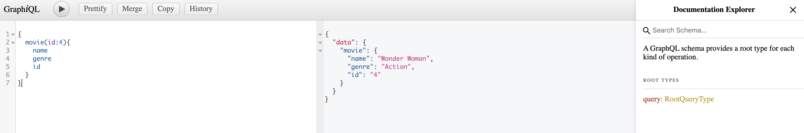

# react-graphql-testing
A template project to demo testing GraphQL server and React Client

A simple system to showcase GraphQL Testing

## Design

## Server (GraphQL)

A repository contains a list of movies with couple of data fields using GraphQL to expose the endpoints

## Schema Type

Thank you [GraphQL Voyager](https://apis.guru/graphql-voyager/)

## Testing GraphQL
The most exciting part, the tests for the server-side GraphQL endpoints are added for,
* Schema
* Queries
* Mutation

I've used `EasyGraphQLTester` node module to help us assit in testing the GraphQL endpoints

All the tests can be found [here](./movies-graphql/server/test/schema.test.js)

## Client (ReactJs)

A React app to interact with the GraphQL endpoints from the UI

To-do